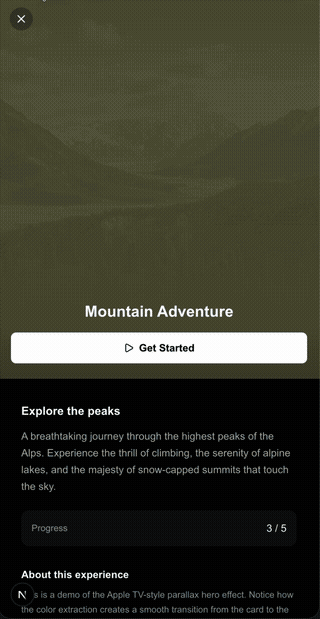

# Apple TV Hero

An Apple TV-style parallax hero effect for Next.js with color extraction, blur transitions, and Ken Burns animation.

<p align="center">
  
</p>

## Features

- **Color Extraction** - Automatically extracts the dominant color from images using canvas sampling
- **Module-Level Caching** - Pre-warm colors on card hover/load for instant transitions
- **Three-Phase Loading** - Smooth animation sequence: color → blur → full image
- **Ken Burns Effect** - Subtle zoom animation (1.25x → 1x) for cinematic feel
- **Scroll-Based Parallax** - Hero responds to scroll with Framer Motion
- **Modal & Page Variants** - Works in both intercepted route modals and full pages
- **TypeScript** - Fully typed with exported interfaces

## Demo

This repo includes a complete demo with:
- Grid of sample cards with color pre-warming
- Click opens intercepted route modal (soft navigation)
- Direct URL navigation (hard navigation)
- Both variants show the same parallax effect

## Quick Start

```bash
# Clone the repo
git clone https://github.com/DerekCounihan/apple-tv-hero.git

# Install dependencies
pnpm install

# Run the demo
pnpm dev
```

Visit [http://localhost:3000](http://localhost:3000) to see the demo.

## Usage

### Basic Example

```tsx
import {
  ParallaxHeroLayout,
  ParallaxHeroContent,
} from "@/components/parallax-hero";
import {
  HeroTitle,
  HeroExtendedContent,
  HeroActionButton,
} from "@/components/hero-content";
import { Play } from "lucide-react";

export default function MyPage() {
  return (
    <ParallaxHeroLayout
      heroImage="/your-image.jpg"
      heroAlt="Description"
      title="Page Title"
      useColorExtraction={true}
      heroExtendedContent={
        <HeroExtendedContent>
          <HeroTitle>Your Amazing Content</HeroTitle>
          <HeroActionButton onClick={() => {}} icon={<Play />}>
            Get Started
          </HeroActionButton>
        </HeroExtendedContent>
      }
    >
      <ParallaxHeroContent>
        {/* Your scrollable content */}
        <div className="px-5 py-6">
          <h2>Content Section</h2>
          <p>Your page content goes here...</p>
        </div>
      </ParallaxHeroContent>
    </ParallaxHeroLayout>
  );
}
```

### Pre-Warming Colors

For instant color transitions, pre-warm the color when images load:

```tsx
import { preWarmImageColor } from "@/components/parallax-hero/use-image-color";

// In your card component
useEffect(() => {
  if (imageLoaded) {
    preWarmImageColor(imageUrl);
  }
}, [imageLoaded, imageUrl]);
```

### Using with Intercepted Routes

For the modal pattern with Next.js parallel routes:

```tsx
// app/layout.tsx
export default function RootLayout({
  children,
  modal,
}: {
  children: React.ReactNode;
  modal: React.ReactNode;
}) {
  return (
    <html lang="en">
      <body>
        {children}
        {modal}
      </body>
    </html>
  );
}

// app/@modal/(.)item/[id]/page.tsx
import { ModalDrawer } from "@/components/demo/modal-drawer";

export default function InterceptedPage() {
  return (
    <ModalDrawer>
      <ParallaxHeroLayout heroImage="..." heroAlt="..." title="..." useColorExtraction>
        {/* Your content */}
      </ParallaxHeroLayout>
    </ModalDrawer>
  );
}
```

## API Reference

### ParallaxHeroLayout

| Prop | Type | Default | Description |
|------|------|---------|-------------|
| `heroImage` | `string` | required | URL of the hero image |
| `heroAlt` | `string` | required | Alt text for accessibility |
| `title` | `string` | required | Page title (used in meta) |
| `useColorExtraction` | `boolean` | `true` | Enable color extraction |
| `heroExtendedContent` | `ReactNode` | - | Content below the hero (mobile) |
| `children` | `ReactNode` | - | Main scrollable content |
| `rightAction` | `ReactNode` | Close button | Custom action in top-right |
| `headerClassName` | `string` | - | Additional header classes |
| `fallbackColor` | `string` | `"#1a1a1a"` | Color when extraction fails |
| `onColorExtracted` | `(color: string) => void` | - | Callback with extracted color |

### Hero Content Components

#### HeroTitle
Animated title with fade-in and slide-up effect.

| Prop | Type | Default | Description |
|------|------|---------|-------------|
| `children` | `ReactNode` | required | Title text |
| `delay` | `number` | `2.5` | Animation delay in seconds |

#### HeroExtendedContent
Container for extended content area below the hero.

| Prop | Type | Default | Description |
|------|------|---------|-------------|
| `children` | `ReactNode` | required | Content |
| `showOnDesktop` | `boolean` | `false` | Show on desktop too |

#### HeroActionButton
Primary action button with icon support.

| Prop | Type | Default | Description |
|------|------|---------|-------------|
| `children` | `ReactNode` | required | Button text |
| `onClick` | `() => void` | required | Click handler |
| `icon` | `ReactNode` | - | Icon before text |
| `variant` | `"primary" \| "secondary"` | `"primary"` | Button style |
| `loading` | `boolean` | `false` | Show loading state |
| `disabled` | `boolean` | `false` | Disable button |

#### HeroProgressBar
Segmented progress indicator.

| Prop | Type | Default | Description |
|------|------|---------|-------------|
| `total` | `number` | required | Total segments |
| `completed` | `number` | required | Completed segments |

## Animation Timeline

| Phase | Timing | Description |
|-------|--------|-------------|
| 1. Color | 0ms | Solid background from extracted/cached color |
| 2. Blur | 200ms | Blur overlay fades in with gradient mask |
| 3. Image | 1000ms | Hero image fades in with Ken Burns zoom |
| 4. Content | 400ms after blur | Extended content slides up |
| 5. Title | 2500ms | Title fades in with slide-up animation |

## How Color Extraction Works

1. **Canvas Sampling** - The image is drawn to an off-screen canvas
2. **Bottom Third Focus** - Samples from the bottom third (where content overlaps)
3. **Brightness Filtering** - Excludes too-dark (<20) and too-light (>235) pixels
4. **Luminance Weighting** - Colors are weighted by perceptual luminance
5. **Module Cache** - Results are cached in a Map for instant reuse

## Dependencies

- `next` ^15.0.0
- `react` ^19.0.0
- `framer-motion` ^11.0.0
- `lucide-react` - Icons
- `clsx` + `tailwind-merge` - Class utilities
- `class-variance-authority` - Component variants

## File Structure

```
src/
├── components/
│   ├── parallax-hero/
│   │   ├── index.ts              # Barrel exports
│   │   ├── parallax-hero-layout.tsx
│   │   ├── use-image-color.ts    # Color extraction hook
│   │   └── modal-context.tsx     # Modal scroll context
│   │
│   ├── hero-content/
│   │   ├── index.ts
│   │   ├── hero-title.tsx
│   │   ├── hero-extended-content.tsx
│   │   ├── hero-action-button.tsx
│   │   └── hero-progress-bar.tsx
│   │
│   └── demo/
│       ├── sample-card.tsx       # Demo card with pre-warming
│       └── modal-drawer.tsx      # Demo modal wrapper
│
├── data/
│   └── sample-items.ts           # Demo data
│
└── app/
    ├── layout.tsx                # Root layout with parallel routes
    ├── page.tsx                  # Card grid demo
    ├── @modal/
    │   ├── default.tsx
    │   └── (.)item/[id]/page.tsx # Intercepted modal
    └── item/[id]/page.tsx        # Direct page
```

## License

MIT

## Credits

Inspired by the Apple TV+ app hero animations.

Sample images from [Unsplash](https://unsplash.com).
